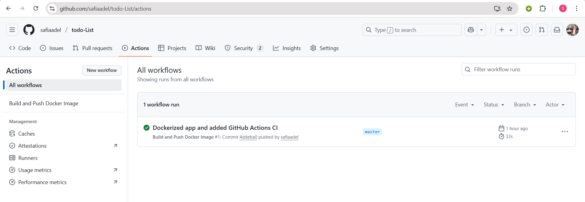
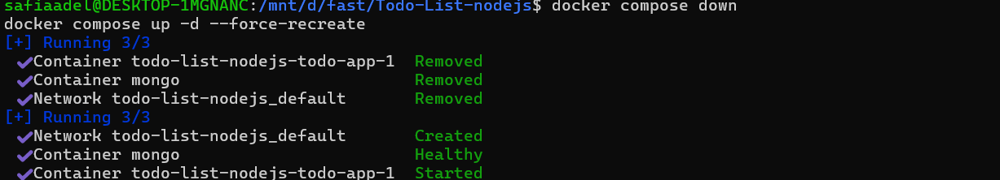
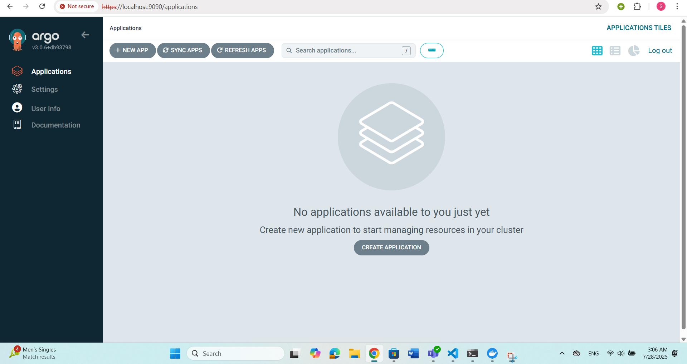
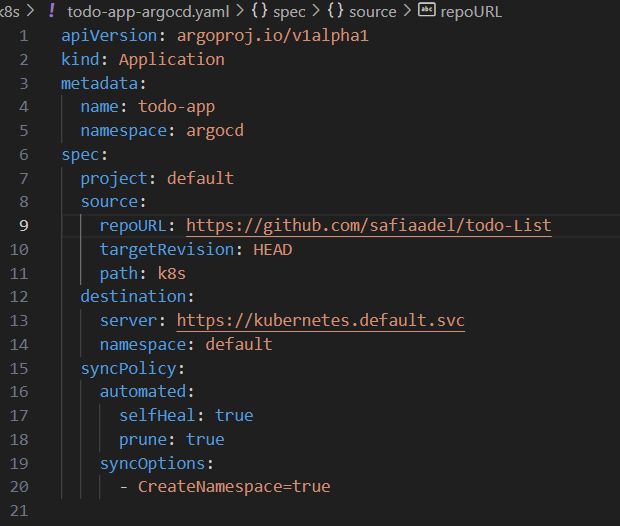
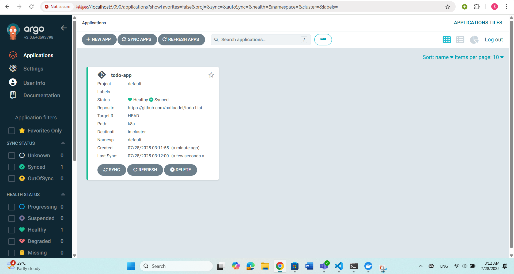
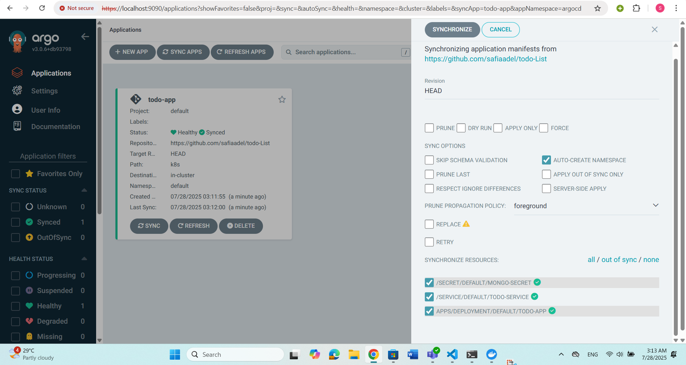
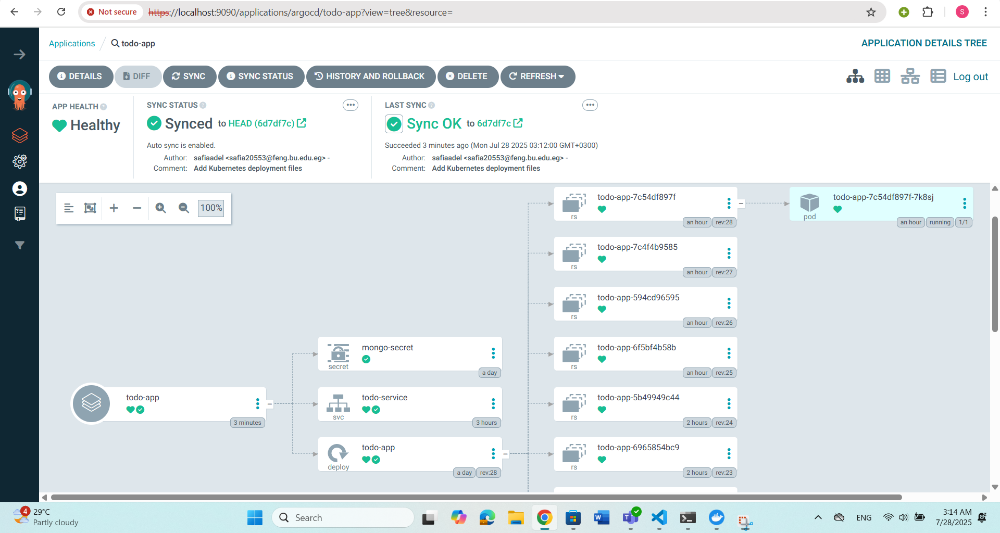
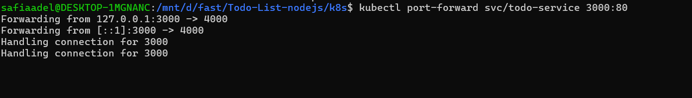

# DevOps Internship Assessment - Todo List Node.js Application

This repository documents the complete implementation of the DevOps Internship Assessment tasks. The project showcases skills in Docker, GitHub Actions, Ansible, Docker Compose, and Kubernetes with ArgoCD.

---

## 📌 Assessment Breakdown

### ✅ Part 1: Application Preparation

**Tasks:**

* Clone this repo: [https://github.com/Ankit6098/Todo-List-nodejs](https://github.com/Ankit6098/Todo-List-nodejs)
* Use your own MongoDB database.
* Dockerize the application.
* Create a GitHub Actions CI pipeline that builds and pushes the image to a private Docker registry.

**Implementation Steps:**

1. **Cloning the Repository**

   ```bash
   git clone https://github.com/Ankit6098/Todo-List-nodejs
   cd Todo-List-nodejs
   ```

2. **Update `.env` file to use personal MongoDB**

3. **Create Dockerfile**

#### docker file


4. **Build and push Docker image manually (initially)**

   ```bash
   docker build -t <your-dockerhub-username>/todo-app:latest .
   docker push <your-dockerhub-username>/todo-app:latest
   ```
#### docker hub repository after push image


#### database connected with docker file


5. **Create GitHub Actions Workflow (`.github/workflows/docker-ci.yml`)**

#### example 


#### github workflow


6. **Verify image pushed to Docker Hub successfully.**


---

### ✅ Part 2: Ansible Setup on Local VM 

**Tasks:**
- Create a Linux VM on your local machine or in the cloud.
- Use Ansible to configure the VM and install Docker.
- Ansible must run from your local machine against the VM.

---

**Implementation Steps:**

1. **Used WSL Ubuntu as the Local Control Node**  
   All Ansible commands were executed from **WSL Ubuntu** running on my local Windows machine.

2. **Setup Project Directory and Files**

   I created a working directory and initialized the necessary Ansible files:

   ```bash
   mkdir -p ~/ansible-docker-setup
   cd ~/ansible-docker-setup
   nano inventory              
   nano install-docker.yml    
   nano ansible.cfg           
  ```


3. **Run the Playbook to Install Docker**
  I used the following command to execute the playbook and install Docker on the target VM:
  ```bash
  ansible-playbook install-docker.yml -k
  ```
  
  


4. **Verify Docker Installation on the VM**

    After successful installation, I logged into the VM and checked the Docker version:

  ```bash
  docker --version
  ```


  Then tested Docker by running the hello-world container:


### ✅ Part 3: Docker Compose & Auto Update 

**Tasks:**

* Use Docker Compose to run the application.
* Add health checks.
* Set up a way to automatically detect and pull new images when the Docker registry is updated.

**Implementation Steps:**

1. **Create `docker-compose.yml`**
   
2. **Start the application**

   ```bash
   docker-compose up -d
   ```
   

   ```bash
   docker compose version
   ```
   

   ```bash
   docker ps
   ```
   

  Visit: `https://localhost:4000`

  
  ```bash
  docker compose down
  ```
  
  ```bash
  docker compose down --volumes
  ```
  
3. **Auto Update Tool (Justification)**

   * Chose **Watchtower** to automatically update the image when a new one is available in Docker Hub.

   * **Add Watchtower to `docker-compose.yml`:**

     ```yaml
     watchtower:
       image: containrrr/watchtower
       volumes:
         - /var/run/docker.sock:/var/run/docker.sock
       restart: always
     ```
  **pushing image and compose up after watchowner**


  **running in http://localhost:4001**


---

### ✅ Part 4: Bonus - Kubernetes & ArgoCD 

**Tasks:**

* Use Kubernetes instead of Docker Compose.
* Use ArgoCD for Continuous Deployment.

**Implementation Steps:**

1. **Install Minikube locally**

2. **Enable Ingress and start Minikube**

   ```bash
   minikube start --driver=docker
   ```

3. **Create Kubernetes Manifests:**

   * `deployment.yaml`
   * `service.yaml`
   * `secret.yaml`


4. **Deploy App to Minikube**

   ```bash
   kubectl apply -f deployment.yaml
   kubectl apply -f service.yaml
   kubectl apply -f secret.yaml
   ```


  **get pods**
  ```bash
  kubectl get pods
  ```


  **check logs**
  ```bash
  kubectl logs <pod-name>
  ```
  

  **get service**
  ```bash
  kubectl get service
  ```
  

  **run locally in minikube**
  ```bash
  minikube service <service-name>
  ```
  

  **application running**

  
  
5. **Install ArgoCD**

   ```bash
   kubectl create namespace argocd
   kubectl apply -n argocd -f https://raw.githubusercontent.com/argoproj/argo-cd/stable/manifests/install.yaml
   ```

6. **Access ArgoCD UI**

   ```bash
   kubectl port-forward svc/argocd-server -n argocd 9090:443
   ```

   Visit: `https://localhost:9090`


* **Username:** admin
* **Password:** Run:

```bash
kubectl get secret argocd-initial-admin-secret -n argocd -o jsonpath="{.data.password}" | base64 -d
```


7. **Deploy App with ArgoCD**



8. **Verify ArgoCD deployed the app successfully.**







**Look for the service related to your app (e.g., todo-service), and port-forward it:**

```bash
kubectl port-forward svc/todo-service 3000:4000
```
**Then open http://localhost:3000 to test your running Todo app.**




